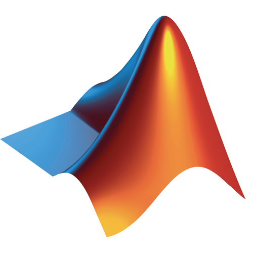

# Hi there 

My name is **Serafin** (AKA El Sera). Mechatronic engineering senior year student. I'm a coding enthusiast, mostly self-taught. Associate Degree in Infotmatics and IT Support.

**Currently working at:** *[BMW](https://www.bmwgroup-werke.com/san-luis-potosi/es.html)* as *IoT and Digitalization Intern*.

**Currently learning:** *[Bootcamp: Especialidad en Ciencia de Datos](https://codigofacilito.com/ciencia-datos)*

***Interests:***
- Backend and Frontend Web Development
- Computer Vision
- Big Data
- Machine Learning

## Tech
Languages, tools and some other stuff I work with.
<table>
  <tr>
    <td align="center" width="96">
      
       Python
    </td>
    <td align="center" width="96">
        
       Javascript
    </td>
    <td align="center" width="96">
        
       Matlab
    </td>
    <td align="center" width="96">
        
       C++
    </td>
    <td align="center" width="96">
        
       HTML
    </td>
    <td align="center" width="96">
        
       CSS
    </td>
    <td align="center" width="96">
        
       SQL
    </td>
    <td align="center" width="96">
        
       R
    </td>
  </tr>
  
  <tr>
    <td align="center" width="96"> 
        
       IT Support
    </td>
    <td align="center" width="96">
        
       VS Code
    </td>
    <td align="center"  width="96">
        
       Git
    </td>
    <td align="center"  width="96">
        
       Jupyter Notebooks
    </td>
    <td align="center" width="96">
        
       MySQL Workbench
    </td>
    <td align="center"  width="96">
        
       Tableau
    </td>
    <td align="center" width="96">
        
       Illustrator
    </td>
    <td align="center" width="96">
        
       Google Suite
    </td>
    <td align="center" width="96">
        
       Bash
    </td>
  </tr>
</table>

## About me
 
-
-
-
-

## Résumé
 
in progress...

## Portfolio
 
in progress...

## GitHub Stats:
Stats

## Where to find me:
Linkedin Github Email Twitter
